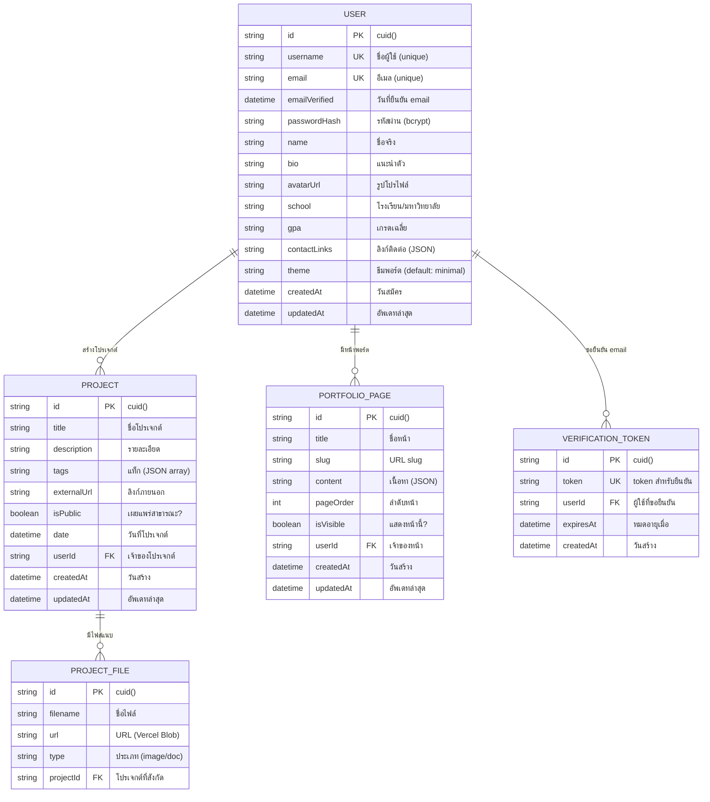

# FolioForge — ER Diagram

เปิดดูแบบ interactive ได้ที่ [mermaid.live](https://mermaid.live) — copy โค้ดด้านล่างไปวาง

## สรุปความสัมพันธ์

| จาก | ความสัมพันธ์ | ไป | คำอธิบาย |
|-----|-------------|-----|----------|
| **User** | 1 : N | **Project** | ผู้ใช้ 1 คนมีได้หลายโปรเจกต์ |
| **User** | 1 : N | **PortfolioPage** | ผู้ใช้ 1 คนมีได้หลายหน้าพอร์ต |
| **User** | 1 : N | **VerificationToken** | ผู้ใช้ 1 คนมีได้หลาย token ยืนยัน |
| **Project** | 1 : N | **ProjectFile** | โปรเจกต์ 1 อันมีได้หลายไฟล์ |

## Unique Constraints

- `User.username` — ชื่อผู้ใช้ห้ามซ้ำ
- `User.email` — อีเมลห้ามซ้ำ
- `VerificationToken.token` — token ห้ามซ้ำ
- `PortfolioPage (userId + slug)` — slug ห้ามซ้ำภายในผู้ใช้เดียวกัน

## Cascade Delete

ลบ User → ลบ Projects, PortfolioPages, VerificationTokens ทั้งหมดของ user นั้น
ลบ Project → ลบ ProjectFiles ทั้งหมดของ project นั้น
