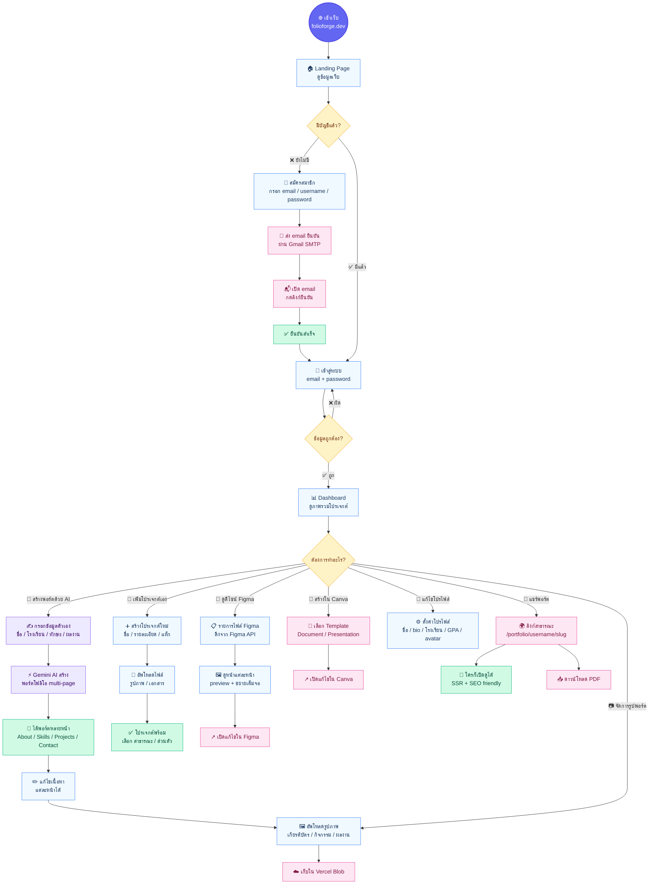

# FolioForge — User Flow

เปิดดูแบบ interactive ได้ที่ [mermaid.live](https://mermaid.live) — copy โค้ดด้านล่างไปวาง

```mermaid
flowchart TD
    START(("🌐 เข้าเว็บ\nfolioforge.dev"))

    START --> LANDING["🏠 Landing Page\nดูข้อมูลเว็บ"]

    LANDING --> HAS_ACC{มีบัญชีแล้ว?}

    %% ── Registration Flow ──
    HAS_ACC -- ❌ ยังไม่มี --> REG["📝 สมัครสมาชิก\nกรอก email / username / password"]
    REG --> SEND_EMAIL["📧 ส่ง email ยืนยัน\nผ่าน Gmail SMTP"]
    SEND_EMAIL --> CHECK_EMAIL["📬 เปิด email\nกดลิงก์ยืนยัน"]
    CHECK_EMAIL --> VERIFIED["✅ ยืนยันสำเร็จ"]
    VERIFIED --> LOGIN

    %% ── Login Flow ──
    HAS_ACC -- ✅ มีแล้ว --> LOGIN["🔐 เข้าสู่ระบบ\nemail + password"]
    LOGIN --> AUTH_CHECK{ข้อมูลถูกต้อง?}
    AUTH_CHECK -- ❌ ผิด --> LOGIN
    AUTH_CHECK -- ✅ ถูก --> DASHBOARD

    %% ── Dashboard ──
    DASHBOARD["📊 Dashboard\nดูภาพรวมโปรเจกต์"]

    DASHBOARD --> CHOICE{ต้องการทำอะไร?}

    %% ── AI Builder Flow ──
    CHOICE -- 🤖 สร้างพอร์ตด้วย AI --> AI_INPUT["✍️ กรอกข้อมูลตัวเอง\nชื่อ / โรงเรียน / ทักษะ / ผลงาน"]
    AI_INPUT --> AI_GEN["⚡ Gemini AI สร้าง\nพอร์ตโฟลิโอ multi-page"]
    AI_GEN --> AI_RESULT["📄 ได้พอร์ตหลายหน้า\nAbout / Skills / Projects / Contact"]
    AI_RESULT --> EDIT_PORT["✏️ แก้ไขเนื้อหา\nแต่ละหน้าได้"]
    EDIT_PORT --> UPLOAD_IMG

    %% ── Manual Project Flow ──
    CHOICE -- 📁 เพิ่มโปรเจกต์เอง --> NEW_PROJ["➕ สร้างโปรเจกต์ใหม่\nชื่อ / รายละเอียด / แท็ก"]
    NEW_PROJ --> UPLOAD_FILE["📎 อัพโหลดไฟล์\nรูปภาพ / เอกสาร"]
    UPLOAD_FILE --> PROJ_DONE["✅ โปรเจกต์พร้อม\nเลือก สาธารณะ / ส่วนตัว"]

    %% ── Upload Images ──
    CHOICE -- 📷 จัดการรูปพอร์ต --> UPLOAD_IMG["🖼️ อัพโหลดรูปภาพ\nเกียรติบัตร / กิจกรรม / ผลงาน"]
    UPLOAD_IMG --> BLOB["☁️ เก็บใน Vercel Blob"]

    %% ── Figma Flow ──
    CHOICE -- 🎨 ดูดีไซน์ Figma --> FIGMA_LIST["📋 รายการไฟล์ Figma\nดึงจาก Figma API"]
    FIGMA_LIST --> FIGMA_PAGES["🖼️ ดูหน้าแต่ละหน้า\npreview + ขยายเต็มจอ"]
    FIGMA_PAGES --> FIGMA_OPEN["↗️ เปิดแก้ไขใน Figma"]

    %% ── Canva Flow ──
    CHOICE -- 📝 สร้างใน Canva --> CANVA["🎨 เลือก Template\nDocument / Presentation"]
    CANVA --> CANVA_EDIT["↗️ เปิดแก้ไขใน Canva"]

    %% ── Profile ──
    CHOICE -- 👤 แก้ไขโปรไฟล์ --> PROFILE["⚙️ ตั้งค่าโปรไฟล์\nชื่อ / bio / โรงเรียน / GPA / avatar"]

    %% ── Share Flow ──
    CHOICE -- 🔗 แชร์พอร์ต --> SHARE["🌍 ลิงก์สาธารณะ\n/portfolio/username/slug"]
    SHARE --> PUBLIC_VIEW["👀 ใครก็เปิดดูได้\nSSR + SEO friendly"]
    SHARE --> EXPORT_PDF["📥 ดาวน์โหลด PDF"]

    %% ── Styling ──
    classDef start fill:#6366f1,stroke:#4f46e5,color:#fff,stroke-width:2px
    classDef action fill:#f0f9ff,stroke:#3b82f6,color:#1e3a5f,stroke-width:1px
    classDef decision fill:#fef3c7,stroke:#f59e0b,color:#78350f,stroke-width:1px
    classDef success fill:#d1fae5,stroke:#10b981,color:#064e3b,stroke-width:1px
    classDef ai fill:#ede9fe,stroke:#8b5cf6,color:#3b0764,stroke-width:1px
    classDef external fill:#fce7f3,stroke:#ec4899,color:#831843,stroke-width:1px

    class START start
    class LANDING,LOGIN,DASHBOARD,REG,NEW_PROJ,UPLOAD_FILE,UPLOAD_IMG,PROFILE,EDIT_PORT,FIGMA_LIST,FIGMA_PAGES action
    class HAS_ACC,AUTH_CHECK,CHOICE decision
    class VERIFIED,PROJ_DONE,AI_RESULT,PUBLIC_VIEW success
    class AI_INPUT,AI_GEN ai
    class SEND_EMAIL,CHECK_EMAIL,BLOB,FIGMA_OPEN,CANVA,CANVA_EDIT,SHARE,EXPORT_PDF external
```
